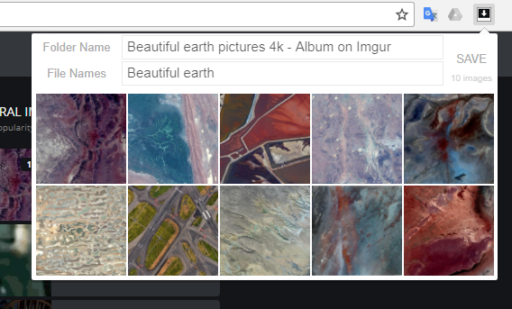

# image-downloader-chrome-extension
Chrome Extension originally written in 2013 to download sets of images from online albums to a folder. The extension scrapes the page to look for images that might be part of an image set by finding the largest image and then looking at the sibling tags.

Clicking on an image tile deselects it so it doesn't get downloaded.

#### TODO
- [ ] Revisit how images are gathered
- [ ] Restyle
